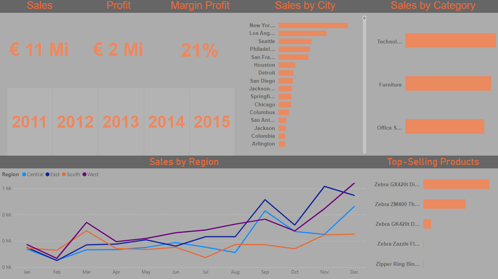

## 📊 Sales Performance Dashboard

This project presents an interactive dashboard focused on sales performance analysis. 
The dashboard provides insights into total sales, total profit, and profit margin (%), 
supporting data-driven decision-making.

### 🔍 Key Analysis
- Total Sales
- Total Profit
- Profit Margin (%)
- Sales by City
- Sales by Category
- Sales by Region
- Sales Trends by Year
- Top-Selling Products Ranking

### 🛠️ Tools & Technologies
- Power BI
- DAX
- Data Modeling
- Data Visualization

### 📌 Objective
To analyze sales performance, evaluate profitability through profit margin (%), 
identify top-performing regions and products, and support strategic business decisions 
using clear and interactive visualizations.

*Figure 1 – Sales analytics dashboard highlighting key KPIs, profitability, and top-selling products.*
